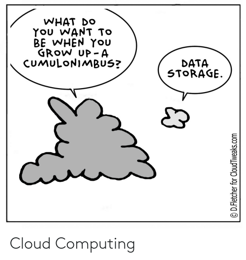

# mongoDB

## Instalación de mongoDB

Utilizaremos la versión 5.0 en adelante de mongoDB Community Server. Según el caso puede instalarla por diversos medios:

* Windows: Instalarla desde la página de descargas https://www.mongodb.com/try/download/community
* Linux: 
  * Instalar desde la pagina de descargas https://www.mongodb.com/try/download/community
  * A través de desde los repositorios de ubuntu o mejor aún los de mongodb inc https://docs.mongodb.com/manual/tutorial/install-mongodb-on-ubuntu/
* Usuarios con experiencia con containers pueden utilizar la imagen de docker: https://hub.docker.com/_/mongo e instalar sólo un cliente para accederlo.

## mongoDB client / GUI

Vamos a utilizar la consola (MongoDB Shell o mongosh como se las conoce), ya que es la herramienta que estará disponible desde la instalación de mongoDB y en cualquier servidor productivo. Sin embargo los alumnos podrán usar cualquier interfaz de su preferencia como por ejemplo Compass o Robomongo.

## Acceder mongoDB

Para acceder a mongoDB usando la línea de comando o un GUI debemos proveer:

* Datos de conexión: (1)
  * host (opcional, default: localhost)
  * port (opcional, default: 27017)
  * database (opcional, default: test)
* Información de  autenticación (opcional)
  * username
  * password
  * authentication database (default: database provisto en datos de la conexión)

**(1)** En caso de utilizar containers deben forwardear el puerto 27017 durante la creación del container y usar 127.0.0.1 como host

```bash
# acceso desde localhost con defaults
$ mongo 

# acceso con datos de conexión
$ mongo 127.0.0.1:27017/myDatabase

# acceso con datos de conexión y autenticación
$ mongo 127.0.0.1:27017/test -u adminUser -p secretPassword --authenticationDatabase admin
```

## Cursos on-line

El presente material tiene el objetivo de ser una introducción general a MongoDB, no ser una capacitación en profundidad sobre la herramienta.

[MongoDB University](https://university.mongodb.com) presenta una serie de cursos gratuitos muy completos y al ser del fabricante los mismos se mantienen constantemente actualizados. De ellos destacamos los siguientes cursos al momento de escribir el documento:

* [MongoDB basics](https://university.mongodb.com/courses/M001/about)
* [MongoDB for SQL Pros](https://university.mongodb.com/courses/M100/about)
* [Data Modeling](https://university.mongodb.com/courses/M320/about)

## Server on-line

MongoDB posee una edición llamada Atlas que permite utilizar una base de datos mongoDB totalmente administrada en los principales proveedores de cloud: AWS, Google Cloud y Azure.

El servicio cuenta con un [free tier](https://www.mongodb.com/database/free) que puede escalarse a pago según los requerimientos del negocio.


Q: Does data goes to heaven?
A: No... I said "CLOUD" not "HEAVEN"

