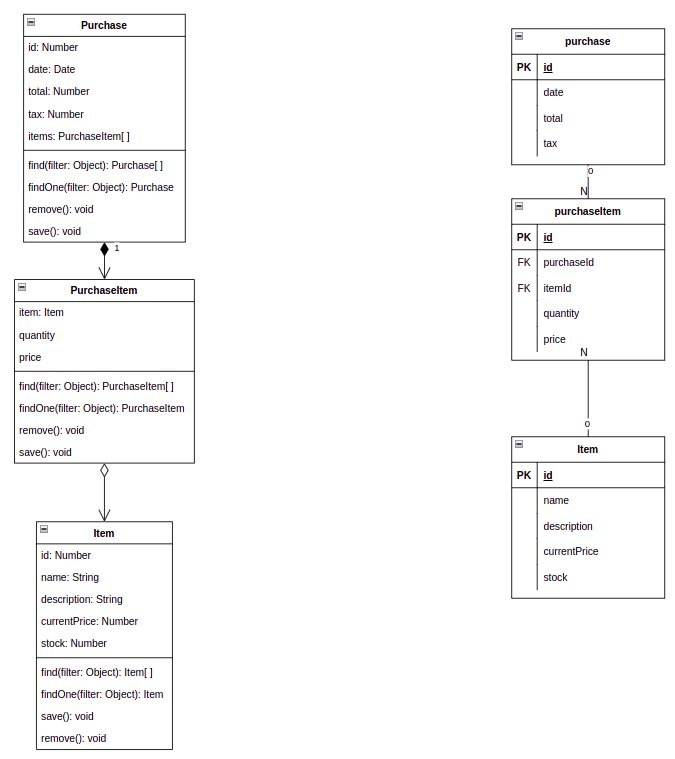
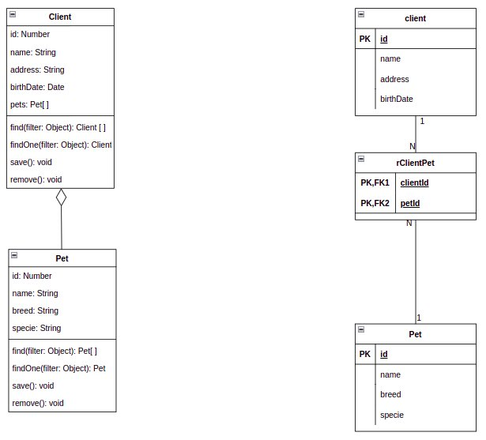
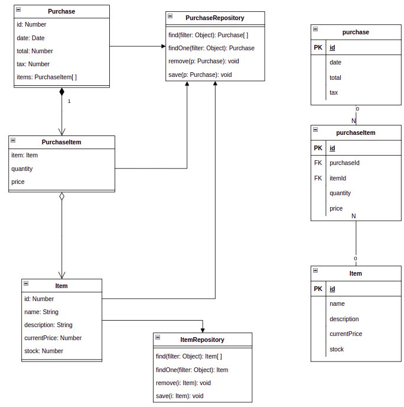
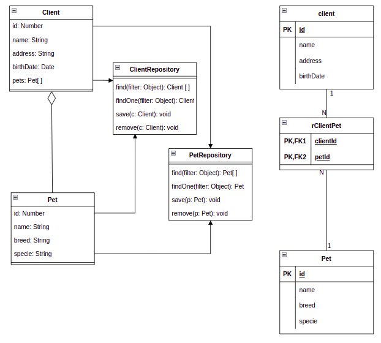

# Object Mapping

## Motivación

Durante el desarrollo de aplicaciones basadas en objetos es muy probable encontrar la necesidad de persistir la información del sistema para evitar problemas como caída del sistema, apagones, fallos de memoria, reinicios, etc. El medio de persistencia más utilizado hoy en día son las bases de datos (relacionales o no).  

Por esta razón se necesita un mecanismo para que los objetos de la aplicación se conviertan  en elementos de la base de datos (registros, documentos, etc.) y para que dichos elementos de la base de datos luego puedan ser capaz de volver a convertir en objetos con la misma estructura y datos que fueron almacenados.

Sin embargo los objetos y el modelo en que son persistidos (registros, documentos, etc.) tienen diferencias en su enfoque, concepto y representación. Esto se conoce como **impedancia** (entendido como la resitencia al flujo de datos de un modelo a otro como objeto a registros u objeto a documento). La impedancia se puede interpretar como la diferencia en la representación entre los objetos y el modelo, la forma de resolver esto es "mapear" los objetos a su medio de persistencia.

## Bases de datos orientadas a objetos

Obviamente si los objetos se persistieran como objetos, es decir como una representación identica a la que tienen en el lenguaje, no habría ninguna impedancia ni se requeriría mapeo alguno.

Con esto en mente se desarrollaron bases de datos orientadas a objetos para lograr la persistencia de objetos.  Sin embargo las bases de datos orientadas a objetos no han podido siquiera acercarse a la performance ofrecida a las bases de datos relacionales o documentales a pesar de varias décadas de intentarlo y han sido abandonadas casi en su totalidad, en particular para su uso en sistemas medianos o grandes.

Sin embargo como herederas de este modelo existen las bases de datos key-value. Las mismas almacenan los objetos (datos) como un "valor" que es posible recuperar utilizando una key que identifica dicho valor. Este tipos de base de datos si han dado resultados satisfactorios para un dominio particular donde las búsquedas pueden hacerse por su id y no necesita realizarse búsquedas extensas para filtrados o vicular gran cantidad de registros (los casos estos suelen resolverse como joins en las bases de datos relacionales).

## Definición de ORM y ODM

Object Mapping es una **técnica de programación que permite la relación de los objetos con los datos que ellos mismos representan**. Cuando la persistenca es mediante una base de datos relacional se denomina ORM (Object/Relational Mapping) y cuando la persistenca se hace en una base de datos documental se llama ODM (Object/Document Mapping). También se llama ORM al Object/Relationa Mapper y ODM al Object/Relational Mapper que son los software o librerías que realizan este mapeo mediante la configuración e información que proveen los desarrolladores a tal fin.

En las bases de datos relacionales la diferencia con el modelo (impedancia) es mucho mayor que en las documentales donde documetos de otras colecciones son referenciados a través de IDs pero pueden existir subdocumentos, arrays o similares que pueden acercar la representación de la base de datos al de los objetos en los lenguajes de programación.

Sin embargo no hay grandes ventajas en este sentido al usar un ORM u ODM ya que a pesar de que las bases de datos documentales son más cercanas al modelo de objetos la trayectoria de las bases de datos relacionales y los ORM ha sido mucho más larga que la de las documentales causando que no haya una clara ventaja en el uso de unos y otros. Siendo mucho más relevante si el modelo del negocio favorece el uso de bases de datos relacionales o documentales.

Incluso muchos de los ORM más utilizados han agregado soporte para bases de datos no-sql y la gran mayoría de los nuevos mappers soportan bases de datos SQL y NoSql (mayormente documental).

## ActiveRecord y DataMapper

La mayoría de los ORM y ODM siguen uno de estos dos patrones:

* ActiveRecord

* DataMapper

Ambos son patrones de arquitectura, descritos por Martin Fowler en *Patterns of Enterprise Application Architecture*. Son patrones para definir la interacción entre los objetos en memoria de un lenguaje de programación con su representación en almacen de datos persistente (usualmente los registros en una base de datos relacional o documentos en una base de datos documental).

### Active Record

En el patron de active record los objetos utilizados en la aplicación son modelos. Entre sus características se encuentran:

* Hay una correspondencia entre cada objeto de la aplicación y su representación en la base de datos. Es decir **UN** objeto se traduce a **UNA** fila de la tabla (o **UN** documento de la colección)

* Sus propiedades se corresponden a las columnas de la tabla de base de datos (o propiedades en el documento).

* El modelo además de ser una entidad en la aplicación tiene métodos para interactuar con el almacenamiento: find, save, remove, etc.

* Las claves foráneas o referencias a otros elementos son representados como propiedades cuyo tipo es otro modelo (Objetos embebidos).

En los siguientes diagramas podemos ver a la izquiera una representación de los objetos y a la derecha una representación de las tablas.

#### Ejemplos

##### Purchase



##### Vet



Como vemos aunque no siempre existe una correspondencia 1 a 1 entre las clases y las tablas si vemos que por cada objeto de nuestra aplicación tendríamos un registro en la db y además por cada propiedad una columna en alguna tabla. Las referencias de FKs se traducen a propiedades del tipo de otro objeto modelo que también implementa el patron AR.

### Data Mapper

En el patron Data Mapper los objetos de la aplicación son llamadas entity y las clases que interactuan con la base de datos repository. Tienen las siguientes características:

* Las entities tiene propiedades y los métodos de acceso a estas (get y set) y pueden (opcionalmente) tener además algún metodo con algo de lógica pero no tienen métodos que le permitan interactuar con la capa de datos.

* Los repository tienen los métodos que permiten interactuar con la base de datos: find, save, remove, etc.

* No es necesario que exista una correspondencia entre las entidades y las tablas ni entre las columnas de alguna tabla con las propiedades de los objetos.

* En general las formas más frecuentes de representar las relaciones (claves foráneas en las bases de datos) son en las entidades mediante referencias a otros objetos.

En los siguientes diagramas podemos ver a la izquiera una representación de los objetos y a la derecha una representación de las tablas.

#### Ejemplos

##### Purchase



##### Vet




### ActiveRecord vs DataMapper

Ambos patrones son muy utilizados en los Object/Relational Mappers. La diferencia principal entre los patrones es que DataMapper busca una mayor independencia entre el modelo de datos y los objetos del dominio, mientras que ActiveRecord busca lograr una mayor simplicidad.

En general AR es más fácil de comprender y de utilizar, suele usarse en aplicaciones más pequeñas donde se prioriza la velocidad de desarrollo y la simplicidad. Además debido a la correlación entre el modelo y la base de datos se adapta mejor a situaciones donde el desarrollo de la aplicación se realiza junto al diseño de la base de datos y el equipo de desarrollo tiene bastante posibilidad de diseñar la base de datos.

Como contrapartida AR es complejo de escalar a aplicaciones muy grandes. Hay un mayor acoplamiento entre el modelo y la base de datos y por lo tanto puede ser más complejo de realizar test unitarios.

DM permite desacoplar mucho más las bases de datos de las entidades. Eso permite realizar mayores optimizaciones a la base de datos y las consultas sin cambio en las entidades o la lógica. El costo de esto es una mayor complejidad y dificultad de compresión.

DM Se adapta mejor para aplicaciones grandes donde el diseño de la base de datos es preexistente o el equipo de desarrollo no tiene decisión sobre ello.

La mayoría de los ORM eligen uno u otro patron pero algunos como TypeOrm permiten elegir entre ambos.

Para ver mejor una comparativa de ambos patrones con una misma base de código puede referirse a la documentación oficial de TypeOrm: [https://typeorm.io/active-record-data-mapper](https://typeorm.io/active-record-data-mapper)

### Definición de Entidades

En este apartado vamos a referirnos de forma amplia a entidades entendiendo que aplica de igual manera a las dos opciones:
* Los objetos Entity del patron de DataMapper.
* Los objetos Model del patron ActiveRecord.

En ambos patrones las entidades deben tener una definición que permita realizar el mapeo a la base de datos. Comunmente incluye:
* La lista de propiedades/atributos, sus tipos y validaciones/restricciones básicas (nulidad, rangos mínimos y máximos, expresiones regulares, valores default, etc).
* Relaciones: como se relacionan con otras entidades, que atributo y que orden de magnitud tiene la relación (one-to-one, one-to-many, many-to-one, many-to-many).
* Índices: simples, únicos y de clave primaria.
* Hooks y custom Methods. Métodos (estáticos o no) para codificar cierto comportamiento predeterminado (búsquedas por cierta clave alternativa, remover contraseñas de un objeto recuperado, implementar cifrado de claves antes del método save, etc).

Generalmente hay 2 mecanismos para implementar la definición de las entidades:
* Decorator.
* Schema.

Aunque aún no hemos dado TypeORM vamos a usarlo de ejemplo ya que disponemos en el mismo mapper de ambas alternativas y podemos hacer una comparativa entre ambas.

En la definición mediante **decorators** la entidad o el modelo son creados como una clase con sus propiedades y métodos y mediante referencias a clases e interfaces (dependiendo del lenguaje de programación con anotaciones u otro medio) que permiten definir la estructura de la clase y su "mapeo" con la base de datos de cada uno de estos ítems. En el ejemplo siguientes vemos algunos ejemplos como: *PrimaryGeneratedColumn*, *Column*, *ManyToOne*, *OneToMany*. Las mismas indican al mapper como "traducir" esta clase en términos de una base de datos relacional.

```typescript
// Definición
import { Entity, Column, PrimaryGeneratedColumn, ManyToOne, OneToMany } from "typeorm"

@Entity()   
export class Category {
    @PrimaryGeneratedColumn() 
    id: number 
    
    @Column() 
    name: string 
    
    @Column() 
    description: string 
    
    @ManyToOne((type) => Category, (category) => category.children)
    parent: Category
    
    @OneToMany((type) => Category, (category) => category.parent)
    children: Category[]
}


```

En el caso de los **schemas**, por lo general hay una clase Schema y otra Model o Entity donde se definen las estructura de la clase, el tipo de datos y la información necesaria para "traducir" las clases a entidades. En estos casos en general cada propiedad del Model o Entity se compone no solo de su nombre si no también de más información a través de variables opcionales para cada característica, por ejemplo tipo, nulidad, valores default, etc.

```typescript
// Definición
import { EntitySchema } from "typeorm"

export interface Category {
    id: number
    name: string
}

export const CategoryEntity = new EntitySchema<Category>({
    name: "category", 
    columns: {
        id: {
            type: Number,
            primary: true,
            generated: true,
        },
        name: {
            type: String,
        },
    },
    relations: {
        parent: {
            type: "many-to-one",
            target: "category", // CategoryEntity
            joinColumn: true,
        },
        children: {
            type: "one-to-mamy",
            target: "category", // CategoryEntity
            inverseSide: "parent",
        },
    },
})
```